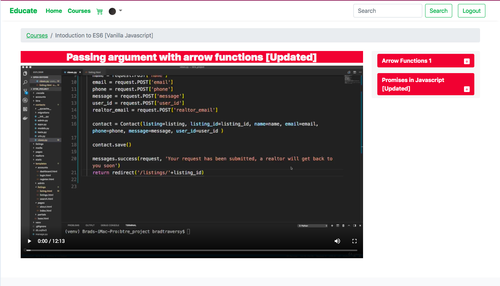

# EDUCATE : Udemy Clone in Django

</img>

>Educate is a Clone Website of Udemy which was Built with Django as a backend Technology. This Website has Following features :
<ul>
<li><h5>
Student is able to Join any Course By paying the amount listed in the course
</h5></li>
<li><h5>Teacher Could Easily Manage (Update, Delete, Add) Courses as per his/her choice</h5></li>
<li><h5>
    Two Types of User Permissions are Handled [Student and Teacher]
</h5></li>
<li><h5>
    Payment Can be Done through Esewa as per Now
</h5></li>
</ul>
# edugate
